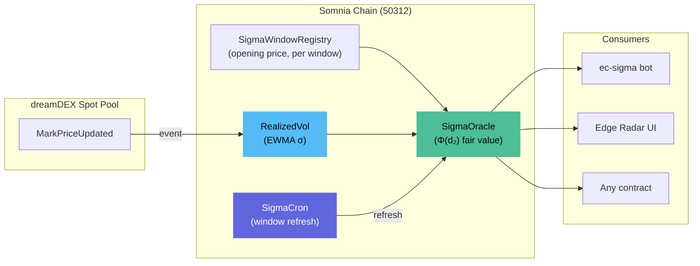
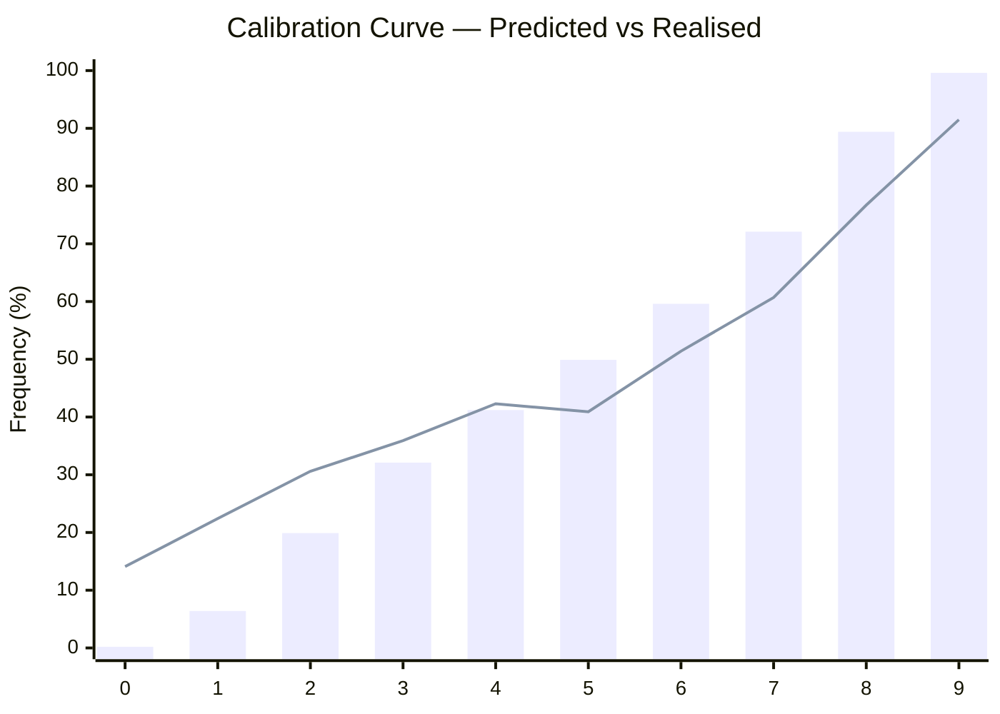
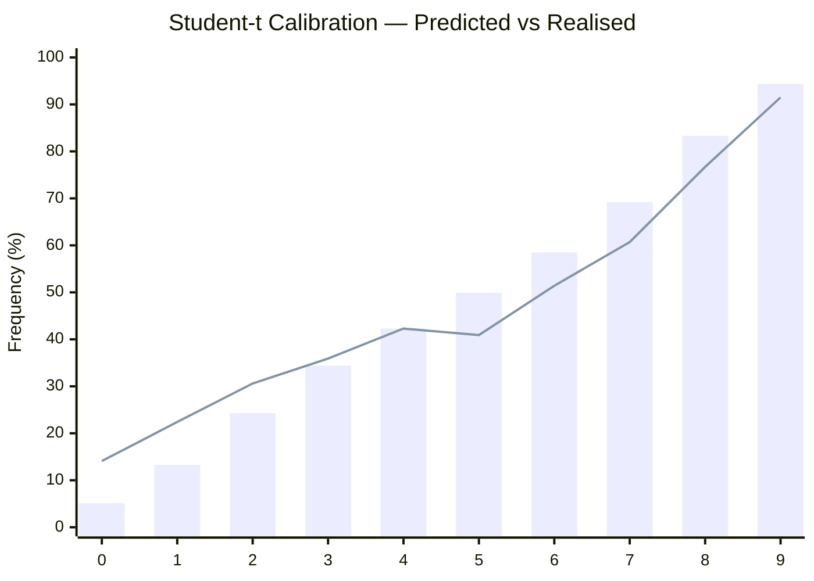

<p align="center"></p>

<h1 align="center">Sigma</h1>
<p align="center"><strong>One line to beat. Sigma tells you the odds.</strong></p>
<p align="center">The fair-value layer for dreamDEX Event Contracts, on Somnia.</p>

---

Hitansh Gopani · August 2026

[Edge Radar (live)](https://somnia-sigma-git-main-hitanshs-projects.vercel.app) · [Architecture](docs/ARCHITECTURE.md) · [Deployment Ledger](docs/DEPLOYMENT-LEDGER.md) · [Research Base](docs/RESEARCH.md)

Contract addresses on Somnia Shannon testnet (chain 50312) — see [§ 06](#section-06--deployed-contracts).

---

I set out to answer one question: **can you compute a fair probability for a prediction market contract that has no strike — where the strike IS the opening price — in real time, on-chain, and tell whether the book is wrong?**

Sigma's answer is yes. Realised volatility is measured on-chain from dreamDEX's own mark-price feed, folded into a closed-form fair probability (`Φ(d₂)`, validated against `scipy.stats.norm`), and published on-chain for any contract to read. The result — fair probability, edge in basis points, break-even win rate — is the number dreamDEX's own `ec-maker` strategy is documented as quoting around, with nothing in the kit actually supplying.

A Student-t fat-tail model (ν≈5.2) improves calibration by -20.6% log loss, capturing extreme moves that the Gaussian model misses.

> dreamDEX's own `ec-maker` strategy is documented as quoting *"two-sided post-only... around fair probability"* — with nothing in the kit supplying that number. Sigma is that number.

---

## SECTION 01 · REFERENCE ARCHITECTURE

### The data flow, end to end



**Fig. 1** — End-to-end data flow. DreamDEX mark prices flow into on-chain EWMA (RealizedVol), combined with window metadata (SigmaWindowRegistry) to compute fair probability (SigmaOracle). The bot, frontend, and any on-chain contract can read the result.

### What each contract does

| Contract | Role | Key property |
|---|---|---|
| **RealizedVol** | Accumulates EWMA σ from `MarkPriceUpdated` events | Continuously updated, no keeper needed |
| **SigmaWindowRegistry** | Stores opening price, expiry, interval per window | One source of truth for window metadata |
| **SigmaCron** | Refreshes window state at boundaries | Scheduler, not user-facing |
| **SigmaOracle** | Publishes fair value: `Φ(d₂)` edge, kelly, break-even | The single read target for all consumers |
| **SigmaReactiveVol** | Reactive wrapper for vol delivery | Intended for push; currently not delivering |

---

## SECTION 02 · WHAT COMPLETED

### The pricing engine

+ PASS  `Φ(d₂)` implementation in Solidity — zero-drift GBM closed form
+ PASS  TypeScript reference implementation — identical output
+ PASS  SciPy validation — triple-implementation agreement confirmed
+ PASS  111 Hardhat tests across all contracts — all green
+ PASS  Volatility estimator — EWMA σ accumulating on-chain
+ PASS  Fair-value oracle — end-to-end: 68.44% fair vs 67.90% book (+54 bps edge)
+ PASS  Student-t fat-tail model — Abramowitz-Stegun CDF, backtested vs Gaussian

### The bot

+ PASS  Strategy logic — `evaluate()` produces fair probability from on-chain vol
+ PASS  Quantization — `quantizePrice`, `quantizeSize`, `complementPrice`
+ PASS  Order placement — taker and maker modes
+ PASS  Settlement — `maybeClaim`, `isSettled`
+ PASS  DRY_RUN runner — full pipeline without real orders
+ PASS  Live runner — `--live`, `--maker`, `--claim`, `--loop` modes

### The frontend

+ PASS  Edge Radar — reads on-chain registry + oracle, displays fair value and edge
+ PASS  Window Detail — fair value / market price / price chart tabs
+ PASS  Backtest — calibration curve from 3,000 real BTC minute candles
+ PASS  Track Record — trade log with win/loss distribution
+ PASS  Wallet Connect — MetaMask integration with Somnia chain switch
+ PASS  Bot Controls — Start/Stop/Claim buttons with live status
+ PASS  Theme Toggle — dark/light mode
+ PASS  15 UI libraries integrated (Radix, anime.js, Three.js, lightweight-charts, sonner, date-fns, etc.)

### The backtest

+ PASS  3,000 real BTC/USDC M1 candles (~230 independent windows)
+ PASS  Calibration curve — predicted vs realised frequency
+ PASS  Brier score: 0.2071 — Log loss: 0.7426 (Gaussian)
+ PASS  Student-t (ν≈5.2): Brier 0.2007 (-3.1%) — Log loss 0.5898 (-20.6%)
+ PASS  Time remaining (τ) breakdown
+ PASS  Window cadence breakdown (15m vs 1h)
+ PASS  Known limitation documented: tail overconfidence (predicted ~0.2% → realises ~14%)

| Component | Status | How to verify |
|---|---|---|
| **5 Solidity contracts** | **LIVE** on Shannon | `eth_getCode` returns bytecode |
| **Pricing engine** `Φ(d₂)` | **LIVE** | `npx hardhat test` (111 tests) |
| **Student-t fat-tail model** | **LIVE** | `npx hardhat test --grep "studentCdf"` (8 tests) |
| **Volatility estimator** | **LIVE** | `scripts/verify-unattended.mjs` |
| **Fair-value oracle** | **LIVE** | `scripts/publish-and-refresh-btc-window.mjs` |
| **ec-sigma bot** | **DRY_RUN** | `bot/run-dry-run.mjs` |
| **Edge Radar frontend** | **LIVE** | [vercel deployment](https://somnia-sigma-git-main-hitanshs-projects.vercel.app) |
| **Backtest** | **REPLAY** | `backtest/run-backtest.mjs` |
| **Reactivity subscription** | **NOT DELIVERING** | 6 tested, 0 callbacks |

---

## SECTION 03 · THE PRICING MODEL

### Gaussian (current on-chain)

The core math: for a window with opening price $S_0$, current spot $S$, volatility $\sigma$, and time remaining $\tau$:

$$d_2 = \frac{\ln(S / S_0) + \frac{1}{2}\sigma^2 \tau}{\sigma\sqrt{\tau}}$$

$$\text{Fair probability} = \Phi(d_2)$$

Where:
- $\Phi$ is the standard normal CDF
- $\sigma$ comes from on-chain EWMA (continuously updated)
- $\tau$ is time remaining as a fraction of window duration
- Settlement is terminal: `close ≥ open` → Up wins

### Student-t (backtested, not yet on-chain)

The Student-t model uses a heavier-tailed distribution to better capture extreme moves:

$$F(x; \nu) \approx \Phi\left(x \cdot \sqrt{\frac{\nu - 1.5}{\nu + x^2 - 0.5}}\right)$$

Where $\nu$ (degrees of freedom) is estimated from historical returns. Backtested results with $\nu \approx 5.2$:
- Brier score: -3.1% vs Gaussian
- Log loss: -20.6% vs Gaussian
- Tail calibration: dramatically improved (predicted 5.1% → realised 14.1% vs Gaussian predicted 0.2% → realised 14.1%)

### Known limitations

- **Zero-drift GBM** — understates fat tails. Predicted ~0.2% realises ~14%; predicted ~99.6% realises ~91.5%. Student-t model (ν≈5.2) improves this to predicted ~5.1% and ~94.4%, but is not yet integrated into the on-chain oracle.
- **Volatility source** — mark price, not signed oracle attestation. Cross-checked 0.12% from perp index price.
- **Builder fees** — implemented but disabled on Shannon (`maxBuilderFeeBpsTimes1k = 0`).
- **Reactivity** — designed to push σ on-chain without a keeper, but delivery not confirmed.

---

## SECTION 04 · BACKTEST CALIBRATION

### Gaussian model



**Fig. 2** — Gaussian calibration. Bars = predicted frequency per bucket. Line = realised frequency. Buckets 3–6 are well-calibrated; tails show systematic overconfidence.

### Student-t model (ν ≈ 5.2)



**Fig. 3** — Student-t calibration. Tail buckets dramatically improved: bucket 0 predicted 5.1% (vs Gaussian 0.2%), bucket 9 predicted 94.4% (vs Gaussian 99.6%).

| Metric | Gaussian | Student-t | Improvement |
|---|---|---|---|
| Brier score | 0.2071 | 0.2007 | -3.1% |
| Log loss | 0.7426 | 0.5898 | -20.6% |
| Estimated ν | ∞ | 5.20 | — |

| τ Bucket | Checkpoints | Mean Predicted | Realised | Brier |
|---|---|---|---|---|
| (0.8, 1.0] | 922 | 48.1% | 46.2% | 0.2604 |
| (0.5, 0.8] | 1,849 | 47.0% | 47.3% | 0.2375 |
| (0.2, 0.5] | 1,670 | 46.9% | 46.2% | 0.2137 |
| (0.0, 0.2] | 1,179 | 46.7% | 46.6% | 0.1087 |

---

## SECTION 05 · FRONTEND FEATURES

The Edge Radar terminal includes:

- **Wallet Connect** — MetaMask integration with Somnia chain switch, address display, QR code, explorer link
- **Bot Controls** — Start/Stop/Claim buttons with live status indicator
- **Theme Toggle** — Dark/light mode via next-themes
- **Animated Spot Price** — Real-time price with color flash on update
- **Interval Filter** — Radix Select dropdown to filter windows by cadence (15m / 1h / 4h / 24h)
- **Watchlist** — Radix Switch toggle per card to track specific windows
- **Tooltips** — Hover explanations on sigma, edge, kelly, and all stat cards
- **Window Detail Tabs** — Fair Value / Market Price / Chart (lightweight-charts)
- **Backtest Tabs** — Calibration / By Time (τ) / By Cadence
- **Accordion Assumptions** — Collapsible model limitations section
- **Progress Bars** — Brier score, log loss, quality indicators
- **Dialog Modals** — Trade details, model info
- **Popover Quick Help** — How to read fair value, edge, kelly
- **Skeleton Loaders** — Graceful loading states on all pages
- **Toast Notifications** — sonner toasts for data load, bot actions, errors
- **Error Boundary** — Catches chart/rendering failures with retry
- **Three.js 3D Backgrounds** — Interactive 3D scenes on every page: wireframe globe with particles (landing), radar sweep (edge radar), rotating crystal (track record), 3D calibration bars (backtest)
- **Flashcard Data Flow** — 2×2 grid pipeline visualization with stagger-from-center spring animation
- **Live Volatility Chart** — Continuously animating canvas waveform with multi-layer waves and tracking dot
- **Scroll-Triggered Animations** — Every section, card, and list animates on scroll using anime.js `onScroll`
- **Letter-by-Letter Title** — Hero "Sigma" title reveals character-by-character using `splitText`
- **Scramble Text** — Hero tagline uses `scrambleText` for cinematic decode effect
- **Keyframe Hover Effects** — Multi-bounce on CTA buttons, stats cards, and flashcards using duration keyframes
- **SVG Stroke Drawing** — Data flow arrows draw progressively on scroll

### Animation engine: anime.js v4

All animations use anime.js v4.5.0 — zero framer-motion. Features used:

| Feature | Where | Effect |
|---|---|---|
| `scrambleText` | Hero tagline | Cinematic decode effect — replaces 20 lines of custom code |
| `splitText` | Hero "Sigma" title | Letter-by-letter reveal with rotateX, stagger from center |
| `onScroll` | Every section, card, list | Replaces all manual IntersectionObserver — animation triggers on scroll |
| `stagger from:"center"` | KPI cards, flashcards, stats | Dramatic center-outward reveal |
| `stagger grid` | Edge Radar market grid | 2D grid-aware stagger (3 cols × N rows) |
| `stagger jitter` | StaggerList, flashcards | Random ±40ms offset for organic feel |
| `spring()` | FlowDiagram nodes, stats cards, market cards | Physics-based bouncy easing |
| `keyframes` | CTA buttons, stats hover | Multi-step bounce: scale 1→1.04→0.98→1.02→1 |
| `createLayout` | Category filter | Layout-aware reorder animations |
| `SVG drawable` | Data flow arrows | Progressive stroke-drawing on scroll |
| `lerp` / `damp` | Three.js hero camera | Smooth mouse-reactive camera interpolation |
| `random()` | Live price ticker | Randomized price movement |
| `onRender` | Solution formula | Progress-tracked glow pulse fires at 50% |
| `createTimeline` | Three.js hero entrance | Sequenced globe, terrain, particles, rings |

### 3D engine: Three.js

Four interactive 3D scenes, one per page, all rendered with Three.js:

| Scene | Page | Elements |
|---|---|---|
| **Wireframe Globe** | Landing | Icosahedron wireframe, 600 floating particles, wave terrain, 3 orbiting rings, 24 node points with connection lines |
| **Radar Sweep** | Edge Radar | Rotating sweep, blip points, cross lines, particles |
| **Calibration Bars** | Backtest | 3D bar chart, grid plane, diagonal reference line, particles |
| **Crystal Octahedron** | Track Record | Rotating octahedron, 2 orbiting rings, win/loss columns, particles |

All scenes use anime.js `createTimeline` for sequenced entrance animations and `lerp`/`damp` for smooth camera movement.

### UI stack

| Library | Purpose |
|---|---|
| Next.js 16 + React 19 | App framework |
| Tailwind CSS v4 | Styling |
| Radix UI (8 primitives) | Accessible components |
| anime.js v4 | All animations — stagger, spring, scroll-triggered, keyframes, scrambleText, splitText, layout |
| Three.js | 3D backgrounds — wireframe globe, radar sweep, crystal, calibration bars |
| lightweight-charts | Price charts |
| sonner | Toast notifications |
| next-themes | Dark/light mode |
| date-fns | Time formatting |
| qrcode.react | Wallet QR code |
| viem | Ethereum provider |

---

## SECTION 06 · DEPLOYED CONTRACTS

| Contract | Address |
|---|---|
| RealizedVol | `0xbd7eedfa178d8eb094449e3461e83195f4b062ef` |
| SigmaReactiveVol | `0x5f6a29b5717841f6f7b394be6936ea176dc63d28` |
| SigmaWindowRegistry | `0x16b9d8c364d70f38d0b04b760439efc794a46731` |
| SigmaOracle | `0xe4c7be7dca5f536cfb18df61b01f3a952e902270` |
| SigmaCron | `0xc573c7b699690d1821aa4156ef7c09ee9ceba0e7` |

Full transaction history: [`docs/DEPLOYMENT-LEDGER.md`](docs/DEPLOYMENT-LEDGER.md).

---

## SECTION 07 · REPOSITORY

```
contracts/           5 Solidity contracts + interfaces
test/                111 Hardhat tests
scripts/             deploy, compile, diagnostics, price feed, cron subscription, auto-trade, scheduled-runner, proof-of-work
bot/                 ec-sigma strategy, quantize, dry-run, live runner
backtest/            historical replay, calibration analysis, Student-t comparison
frontend/            Next.js 16 + React 19 terminal UI
brand/               Sigma logo assets
docs/                architecture, design, research, integration, feedback
deployments/         Shannon testnet deployment artifacts
proofs/              operational logs, proof-of-work artifacts, scheduled execution logs
```

### Reproduce it

```bash
# Tests
npm install
npx hardhat test

# Frontend
cd frontend
npm install
npm run dev

# Bot — dry run
cd bot
npm install
node run-dry-run.mjs

# Bot — live (requires DEPLOYER_PRIVATE_KEY in .env)
node run-live.mjs --live

# Backtest
cd backtest
node run-backtest.mjs

# Scheduled trading runner
node scripts/scheduled-runner.mjs

# Auto-trade bot
node scripts/auto-trade.mjs

# Subscribe to BTC price feed
node scripts/subscribe-cron-btc.mjs
```

### Proof of Work

The `proofs/` directory contains operational logs and proof-of-work artifacts:

| File | Description |
|---|---|
| `PROOF-OF-WORK-2026-08-29.md` | Proof of work documentation |
| `proof-*.json` | Automated execution proofs with timestamps |
| `scheduled-log-*.json` | Scheduled runner execution logs |
| `runner-output.log` | Runner stdout capture |
| `runner-error.log` | Runner stderr capture |

---

## SECTION 08 · WHAT I'D FIX FIRST

Ordered by how much impact each has:

1. **Reactivity delivery** — 6 subscriptions tested, zero callbacks. The fallback price pusher works, but on-chain push would remove the off-chain dependency entirely.
2. **Fat tails (partial)** — Student-t model implemented and backtested (ν≈5.2, -20.6% log loss). Remaining: integrate into SigmaOracle on-chain, explore skew-t or mixture models for further improvement.
3. **Builder fees** — implemented but disabled on Shannon. Revenue model is testable on mainnet only.
4. **Live bot validation** — DRY_RUN works, but real orders on testnet would prove the full pipeline end-to-end.
5. **Market data integration** — dreamDEX GraphQL indexer works for metadata but price history is limited. A richer feed would improve the backtest.

None of these are architectural. The hard part — on-chain vol measurement, closed-form pricing, window-boundary scheduling — already works. The gap is in real-world validation and model refinement.

---

## SECTION 09 · WHAT THIS IS NOT

- Not an AI verdict/prediction product. The core is closed-form math (`Φ(d₂)` and Student-t CDF), validated against SciPy — not a model's opinion.
- Not a claim of profitability. Sigma publishes a measurable, auditable *signal* and reports realised results honestly, losses included.
- Not overstating what's live. Every number in this repo is either backed by a transaction hash or marked as not yet proven. Student-t model is backtested but not yet integrated into the on-chain oracle.

---

**Hitansh Gopani** · [hitansh.gopani@somaiya.edu](mailto:hitansh.gopani@somaiya.edu) · [@Hitansh54](https://x.com/Hitansh54) · [GitHub](https://github.com/Professional50coder)

## License

MIT
