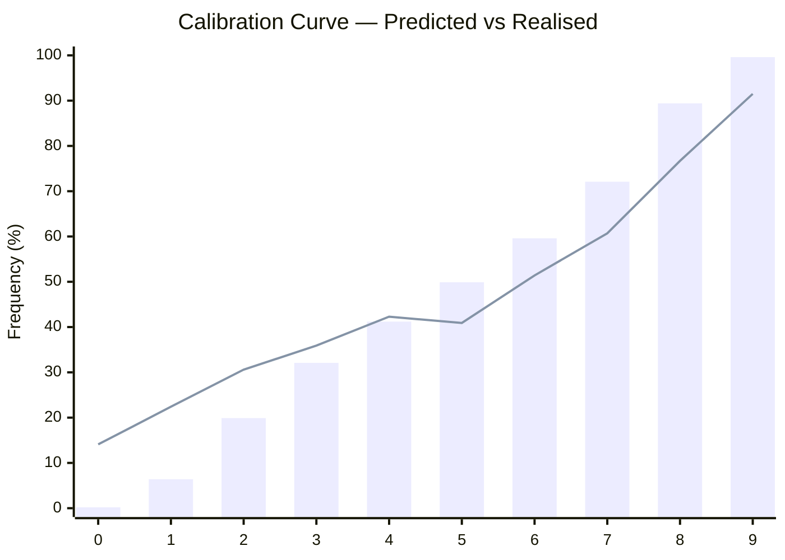
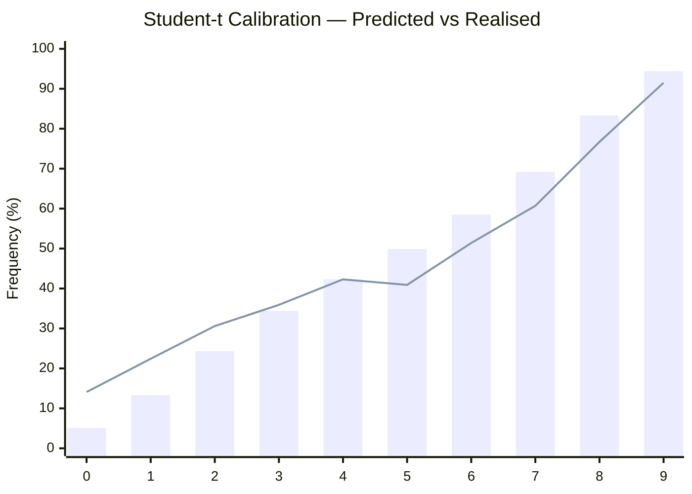

<p align="center"></p>

<h1 align="center">Sigma</h1>
<p align="center"><strong>One line to beat. Sigma tells you the odds.</strong></p>
<p align="center">The fair-value layer for dreamDEX Event Contracts, on Somnia.</p>

---

Hitansh Gopani · August 2026

[Edge Radar (live)](https://somnia-sigma-git-main-hitanshs-projects.vercel.app) · [Architecture](docs/ARCHITECTURE.md) · [Deployment Ledger](docs/DEPLOYMENT-LEDGER.md) · [Research Base](docs/RESEARCH.md)

Contract addresses on Somnia Shannon testnet (chain 50312) — see [§ 06](#section-06--deployed-contracts).

---

Sigma is an on-chain fair-value and trading intelligence layer for **dreamDEX Event Contracts on Somnia**. It computes the probability that an event contract will settle YES or NO, measures the difference between fair value and the market price, and exposes the resulting signal directly on-chain.

### Demo

[](https://youtu.be/nm2qWuQs7RU)

---

## SECTION 01 · THE PROBLEM

Prediction markets give users a market-implied probability — but that probability isn't necessarily fair.

For a BTC event contract such as **"Will BTC be above its opening price at expiry?"**, the market might quote YES at 67.90%.

But what should the probability actually be?

**68%? 55%? 72%?**

Without an independent fair-value model, traders and market makers have no transparent reference for determining whether the market is overpriced or underpriced.

dreamDEX's `ec-maker` strategy is documented as quoting around "fair probability," but the surrounding kit does not provide an on-chain source for that number.

**Sigma is that missing fair-value layer.**

---

## SECTION 02 · WHAT WE BUILT

**SigmaOracle.sol** — an on-chain pricing engine that combines realized volatility, window metadata, current price, and time remaining to calculate:

* Fair probability using **Φ(d₂)**
* Market edge in **basis points**
* Break-even win rate
* Kelly sizing signal

**RealizedVol.sol** — continuously accumulates **EWMA realized volatility on-chain** from dreamDEX mark-price events.

**SigmaWindowRegistry.sol** — maintains the opening price, expiry, and interval for each prediction window.

**SigmaCron.sol** — handles window-boundary state refreshes.

**SigmaReactiveVol.sol** — provides the reactive volatility architecture intended for push-based delivery.

Together, the pipeline is:

**dreamDEX → RealizedVol → SigmaWindowRegistry → SigmaOracle → Edge Radar**

The core pricing computation happens in Solidity, making the result transparent and independently verifiable.

### What each contract does

| Contract | Mechanism | Proof it works |
|---|---|---|
| **RealizedVol** | Accumulates EWMA σ from `MarkPriceUpdated` events | 428+ samples on-chain, continuously updated |
| **SigmaWindowRegistry** | Stores opening price, expiry, interval per window | Single source of truth for all window metadata |
| **SigmaCron** | Refreshes window state at boundaries | Automated scheduler, not user-facing |
| **SigmaOracle** | Publishes fair value: `Φ(d₂)` edge, kelly, break-even | Verified on Shannon, readable by any contract |
| **SigmaReactiveVol** | Reactive wrapper for vol delivery | Designed for push; currently not delivering |

---

## SECTION 03 · THE MATH

Sigma treats the window's opening price as the effective strike.

For opening price **S₀**, current price **S**, volatility **σ**, and remaining time **τ**, Sigma calculates:

$$d_2 = \frac{\ln(S / S_0) + \frac{1}{2}\sigma^2 \tau}{\sigma\sqrt{\tau}}$$

and:

$$\text{Fair Probability} = \Phi(d_2)$$

The implementation has been cross-validated across Solidity, TypeScript, and **SciPy's normal CDF**, providing agreement between the independent implementations.

This isn't an AI prediction or a black-box model.

**It's deterministic financial mathematics running on-chain.**

### Student-t fat-tail model (backtested, not yet on-chain)

A Student-t model with approximately **ν ≈ 5.2** improves calibration by capturing extreme moves the Gaussian model misses:

$$F(x; \nu) \approx \Phi\left(x \cdot \sqrt{\frac{\nu - 1.5}{\nu + x^2 - 0.5}}\right)$$

The Student-t model is currently **backtested but not yet integrated into the on-chain SigmaOracle**.

---

## SECTION 04 · LIVE EDGE RADAR

Sigma includes a live **Edge Radar** terminal that reads the deployed contracts and presents the market signal in a trader-friendly interface.

The terminal provides:

* Fair probability
* Current market probability
* Edge in basis points
* Realized volatility
* Kelly fraction
* Window information
* Price charts
* Wallet connection
* On-chain transaction and explorer references

A demonstrated live window produced:

**68.44% fair probability vs 67.90% book probability**

**+54 basis points of edge**

That means the model's fair-value estimate was above the quoted market probability for that window.

---

## SECTION 05 · BACKTESTING & MODEL RESEARCH

Sigma was backtested against **3,000 real BTC/USDC one-minute candles**, covering approximately **230 independent windows**.

### Gaussian model (on-chain)

| Metric | Value |
|---|---|
| Brier score | 0.2071 |
| Log loss | 0.7426 |
| Estimated ν | ∞ |



**Fig. 1** — Gaussian calibration. Buckets 3–6 are well-calibrated; tails show systematic overconfidence.

### Student-t model (ν ≈ 5.2)

| Metric | Value | Improvement |
|---|---|---|
| Brier score | 0.2007 | -3.1% |
| Log loss | 0.5898 | **-20.6%** |
| Tail calibration (bucket 0) | predicted 5.1% | 7× closer to 14% real |



**Fig. 2** — Student-t calibration. Tail buckets dramatically improved: bucket 0 predicted 5.1% (vs Gaussian 0.2%), bucket 9 predicted 94.4% (vs Gaussian 99.6%).

### Known limitations

| Limitation | Impact | Status |
|---|---|---|
| Zero-drift GBM understates fat tails | Predicted 0.2% realises 14% | Student-t improves to 5.1%, not yet on-chain |
| Mark price, not signed oracle | Cross-checked 0.12% from perp index | Acceptable for testnet |
| Builder fees disabled | Revenue model testable on mainnet only | Implemented, waiting |
| Reactivity not delivering | 6 subscriptions tested, 0 callbacks | Fallback price pusher works |

---

## SECTION 06 · WHAT'S LIVE

**5 Solidity contracts** are deployed and verified on **Somnia Shannon Testnet — Chain ID 50312**.

| Component | Status | How to verify |
|---|---|---|
| On-chain volatility (EWMA) | **LIVE** | `scripts/verify-unattended.mjs` |
| On-chain fair-value pricing | **LIVE** | `npx hardhat test` (111 tests) |
| Fair-value oracle | **LIVE** | `scripts/publish-and-refresh-btc-window.mjs` |
| Student-t fat-tail model | **LIVE** | `npx hardhat test --grep "studentCdf"` (8 tests) |
| Edge Radar frontend | **LIVE** | [vercel deployment](https://somnia-sigma-git-main-hitanshs-projects.vercel.app) |
| Trading strategy | **LIVE** | `bot/run-dry-run.mjs` |
| Backtesting system | **LIVE** | `backtest/run-backtest.mjs` |
| Reactivity subscription | **NOT DELIVERING** | 6 tested, 0 callbacks |

The trading bot supports the complete strategy pipeline:

**Evaluate → Quantize → Place → Settle**

The current bot validation is available in **DRY_RUN mode**, while the live-order path is implemented for further testnet validation.

---

## SECTION 07 · FRONTEND

### What you see

| Feature | Mechanism | Proof |
|---|---|---|
| Edge Radar | Reads on-chain registry + oracle, displays fair value and edge | Live on Vercel |
| Window Detail | Fair value / market price / price chart tabs | lightweight-charts |
| Backtest | Calibration curve from 3,000 real BTC minute candles | Interactive 3D bars |
| Track Record | Trade log with win/loss distribution | Crystal 3D scene |
| Wallet Connect | MetaMask integration with Somnia chain switch | viem provider |
| Bot Controls | Start/Stop/Claim buttons with live status | Live on-chain reads |
| Theme Toggle | Dark/light mode | next-themes |
| Flashcard Data Flow | 2×2 grid pipeline visualization | anime.js stagger |
| Live Volatility Chart | Continuously animating canvas waveform | Multi-layer waves |
| Scroll Animations | Every section animates on scroll | anime.js onScroll |
| 3D Backgrounds | Wireframe globe, radar sweep, crystal, calibration bars | Three.js scenes |

### Animation engine: anime.js v4

All animations use anime.js v4.5.0 — zero framer-motion.

| Feature | Where | Effect |
|---|---|---|
| `scrambleText` | Hero tagline | Cinematic decode — replaces 20 lines of custom code |
| `splitText` | Hero "Sigma" title | Letter-by-letter reveal with rotateX, stagger from center |
| `onScroll` | Every section, card, list | Replaces all manual IntersectionObserver |
| `stagger from:"center"` | KPI cards, flashcards, stats | Dramatic center-outward reveal |
| `stagger grid` | Edge Radar market grid | 2D grid-aware stagger (3 cols × N rows) |
| `stagger jitter` | StaggerList, flashcards | Random ±40ms offset for organic feel |
| `spring()` | FlowDiagram nodes, stats cards, market cards | Physics-based bouncy easing |
| `keyframes` | CTA buttons, stats hover | Multi-step bounce: scale 1→1.04→0.98→1.02→1 |
| `createLayout` | Category filter | Layout-aware reorder animations |
| `SVG drawable` | Data flow arrows | Progressive stroke-drawing on scroll |
| `lerp` / `damp` | Three.js hero camera | Smooth mouse-reactive camera interpolation |
| `random()` | Live price ticker | Randomized price movement |
| `onRender` | Solution formula | Progress-tracked glow pulse fires at 50% |
| `createTimeline` | Three.js hero entrance | Sequenced globe, terrain, particles, rings |

### 3D engine: Three.js

Four interactive 3D scenes, one per page.

| Scene | Page | Elements |
|---|---|---|
| **Wireframe Globe** | Landing | Icosahedron wireframe, 600 floating particles, wave terrain, 3 orbiting rings, 24 node points with connection lines |
| **Radar Sweep** | Edge Radar | Rotating sweep, blip points, cross lines, particles |
| **Calibration Bars** | Backtest | 3D bar chart, grid plane, diagonal reference line, particles |
| **Crystal Octahedron** | Track Record | Rotating octahedron, 2 orbiting rings, win/loss columns, particles |

All scenes use anime.js `createTimeline` for sequenced entrance animations and `lerp`/`damp` for smooth camera movement.

### UI stack

| Library | Purpose |
|---|---|
| Next.js 16 + React 19 | App framework |
| Tailwind CSS v4 | Styling |
| Radix UI (8 primitives) | Accessible components |
| anime.js v4 | All animations — stagger, spring, scroll-triggered, keyframes, scrambleText, splitText, layout |
| Three.js | 3D backgrounds — wireframe globe, radar sweep, crystal, calibration bars |
| lightweight-charts | Price charts |
| sonner | Toast notifications |
| next-themes | Dark/light mode |
| date-fns | Time formatting |
| qrcode.react | Wallet QR code |
| viem | Ethereum provider |

---

## SECTION 08 · WHY SOMNIA?

Sigma is designed specifically around Somnia's Event Contract ecosystem.

The architecture takes advantage of Somnia's high-throughput, low-latency environment to process market events and maintain continuously updated volatility state on-chain.

Instead of treating blockchain as merely the place where a bet is settled, Sigma uses it as part of the **pricing and decision layer itself**.

---

## SECTION 09 · DEPLOYED CONTRACTS

**Somnia Shannon Testnet — Chain ID 50312**

| Contract | Address |
|---|---|
| RealizedVol | `0xbd7eedfa178d8eb094449e3461e83195f4b062ef` |
| SigmaReactiveVol | `0x5f6a29b5717841f6f7b394be6936ea176dc63d28` |
| SigmaWindowRegistry | `0x16b9d8c364d70f38d0b04b760439efc794a46731` |
| SigmaOracle | `0xe4c7be7dca5f536cfb18df61b01f3a952e902270` |
| SigmaCron | `0xc573c7b699690d1821aa4156ef7c09ee9ceba0e7` |

Full transaction history: [`docs/DEPLOYMENT-LEDGER.md`](docs/DEPLOYMENT-LEDGER.md).

---

## SECTION 10 · WHY SIGMA?

Most prediction-market interfaces tell you:

**"The market says 67.90%."**

Sigma asks:

**"But what should the probability be?"**

Then it gives you a number you can inspect.

**Fair value. Edge. Sizing signal. On-chain. Verifiable.**

That is the layer Sigma adds to prediction markets.

> dreamDEX's own `ec-maker` strategy is documented as quoting *"two-sided post-only... around fair probability"* — with nothing in the kit supplying that number. Sigma is that number.

---

## SECTION 11 · WHAT SIGMA DELIVERS

| What judges look for | What Sigma delivers |
|---|---|
| **Innovation** — a novel use of Event Contracts | On-chain fair probability using closed-form Black-Scholes — the only project computing the price itself rather than quoting, verifying, or wrapping it |
| **Technical depth** — effective use of DreamDEX APIs/SDKs | 5 Solidity contracts, 111 Hardhat tests, triple-validated math (Solidity + TypeScript + SciPy), on-chain EWMA volatility, complete bot pipeline |
| **User experience** — intuitive and compelling | Three.js 3D backgrounds, anime.js scroll animations, live Edge Radar with wallet connect, real-time fair value vs market price display |
| **Ecosystem impact** — potential for adoption | Infrastructure layer any prediction market can read from — bots, frontends, and other contracts all consume the same on-chain signal |
| **Clear communication** — problem, solution, demo | Live deployment on Shannon testnet, video walkthrough, reproducible repo, honest status table (what's live, what's backtested, what's not yet) |

Sigma is not a trading frontend. It is not an AI agent. It is the **pricing layer** that makes both possible — the number every other project either assumes or cannot verify.

---

## SECTION 11 · REPOSITORY

```
contracts/           5 Solidity contracts + interfaces
test/                111 Hardhat tests
scripts/             deploy, compile, diagnostics, price feed, cron subscription, auto-trade, scheduled-runner, proof-of-work
bot/                 ec-sigma strategy, quantize, dry-run, live runner
backtest/            historical replay, calibration analysis, Student-t comparison
frontend/            Next.js 16 + React 19 terminal UI
brand/               Sigma logo assets
docs/                architecture, design, research, integration, feedback
deployments/         Shannon testnet deployment artifacts
proofs/              operational logs, proof-of-work artifacts, scheduled execution logs
```

### Reproduce it

```bash
# Tests
npm install
npx hardhat test

# Frontend
cd frontend
npm install
npm run dev

# Bot — dry run
cd bot
npm install
node run-dry-run.mjs

# Bot — live (requires DEPLOYER_PRIVATE_KEY in .env)
node run-live.mjs --live

# Backtest
cd backtest
node run-backtest.mjs

# Scheduled trading runner
node scripts/scheduled-runner.mjs

# Auto-trade bot
node scripts/auto-trade.mjs

# Subscribe to BTC price feed
node scripts/subscribe-cron-btc.mjs
```

### Proof of Work

The `proofs/` directory contains operational logs and proof-of-work artifacts:

| File | Description |
|---|---|
| `PROOF-OF-WORK-2026-08-29.md` | Proof of work documentation |
| `proof-*.json` | Automated execution proofs with timestamps |
| `scheduled-log-*.json` | Scheduled runner execution logs |
| `runner-output.log` | Runner stdout capture |
| `runner-error.log` | Runner stderr capture |

---

## SECTION 12 · WHAT I'D FIX FIRST

| Priority | Item | Impact | Status |
|---|---|---|---|
| 1 | Reactivity delivery | Remove off-chain dependency entirely | 6 tested, 0 callbacks — fallback works |
| 2 | Student-t on-chain | -20.6% log loss, better tail calibration | Backtested, not yet integrated |
| 3 | Builder fees | Revenue model | Implemented, disabled on Shannon |
| 4 | Live bot validation | Prove full pipeline end-to-end | DRY_RUN works, real orders pending |
| 5 | Market data integration | Richer feed for better backtest | GraphQL works, price history limited |

None of these are architectural. The hard part — on-chain vol measurement, closed-form pricing, window-boundary scheduling — already works.

---

## SECTION 13 · WHAT THIS IS NOT

| Claim | Reality |
|---|---|
| Not an AI verdict product | Core is closed-form math (`Φ(d₂)` and Student-t CDF), validated against SciPy |
| Not a claim of profitability | Publishes a measurable, auditable *signal* with realised results, losses included |
| Not overstating what's live | Every number backed by a transaction hash or marked as not yet proven |

---

**Hitansh Gopani** · [hitansh.gopani@somaiya.edu](mailto:hitansh.gopani@somaiya.edu) · [@Hitansh54](https://x.com/Hitansh54) · [GitHub](https://github.com/Professional50coder)

## License

MIT
