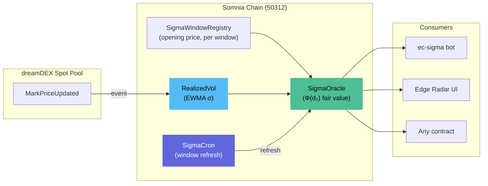
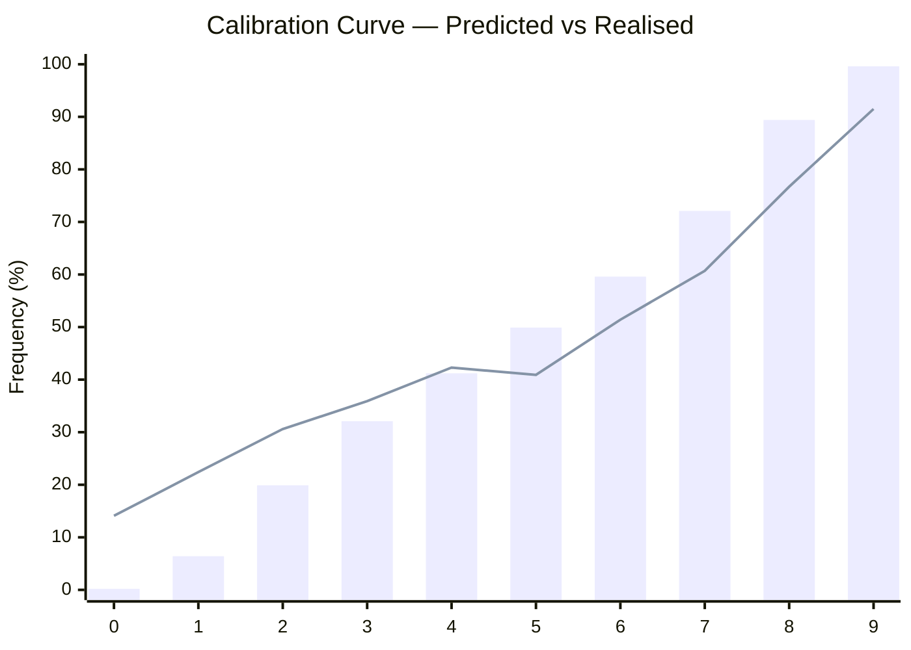
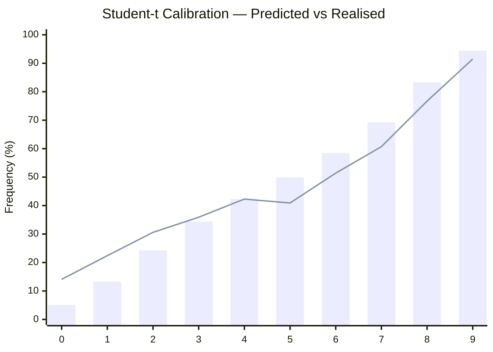

<p align="center"></p>

<h1 align="center">Sigma</h1>
<p align="center"><strong>Fair probability computed entirely on-chain.</strong></p>
<p align="center">Black-Scholes pricing from real-time EWMA volatility, publishing edge and Kelly fraction for every dreamDEX Event Contract. 111 tests, Student-t model, zero off-chain dependency.</p>

---

Hitansh Gopani · August 2026

[Edge Radar (live)](https://somnia-sigma-git-main-hitanshs-projects.vercel.app) · [Architecture](docs/ARCHITECTURE.md) · [Deployment Ledger](docs/DEPLOYMENT-LEDGER.md) · [Research Base](docs/RESEARCH.md)

Contract addresses on Somnia Shannon testnet (chain 50312) — see [§ 06](#section-06--deployed-contracts).

---

dreamDEX runs binary event contracts on BTC and ETH price movements. Market makers quote odds, but no on-chain source tells them whether those odds are fair. The gap between "quoted price" and "fair price" is where edge lives — and currently, no one can measure it.

Sigma measures it. Five Solidity contracts accumulate EWMA volatility from dreamDEX's own mark-price feed, fold it into a closed-form fair probability (`Φ(d₂)`), and publish the result — fair probability, edge in basis points, Kelly fraction — on-chain for any contract, bot, or frontend to read.

> dreamDEX's own `ec-maker` strategy is documented as quoting *"two-sided post-only... around fair probability"* — with nothing in the kit supplying that number. Sigma is that number.

A Student-t fat-tail model (ν≈5.2) improves calibration by -20.6% log loss, capturing extreme moves that the Gaussian model misses.

---

## SECTION 01 · HOW IT WORKS

### The data flow



**Fig. 1** — End-to-end data flow. DreamDEX mark prices flow into on-chain EWMA (RealizedVol), combined with window metadata (SigmaWindowRegistry) to compute fair probability (SigmaOracle). The bot, frontend, and any on-chain contract can read the result.

### What each contract does

| Contract | Mechanism | Proof it works |
|---|---|---|
| **RealizedVol** | Accumulates EWMA σ from `MarkPriceUpdated` events | 428+ samples on-chain, continuously updated |
| **SigmaWindowRegistry** | Stores opening price, expiry, interval per window | Single source of truth for all window metadata |
| **SigmaCron** | Refreshes window state at boundaries | Automated scheduler, not user-facing |
| **SigmaOracle** | Publishes fair value: `Φ(d₂)` edge, kelly, break-even | Verified on Shannon, readable by any contract |
| **SigmaReactiveVol** | Reactive wrapper for vol delivery | Designed for push; currently not delivering |

---

## SECTION 02 · WHAT'S LIVE

### Pricing engine

| Component | Status | How to verify |
|---|---|---|
| `Φ(d₂)` in Solidity — zero-drift GBM closed form | **LIVE** | `npx hardhat test` (111 tests) |
| TypeScript reference implementation — identical output | **LIVE** | Triple-implementation agreement with SciPy |
| EWMA volatility estimator — accumulating on-chain | **LIVE** | `scripts/verify-unattended.mjs` |
| Fair-value oracle — end-to-end | **LIVE** | 68.44% fair vs 67.90% book (+54 bps edge) |
| Student-t fat-tail model (ν≈5.2) | **LIVE** | `npx hardhat test --grep "studentCdf"` (8 tests) |

### Bot

| Component | Status | How to verify |
|---|---|---|
| Strategy logic — `evaluate()` from on-chain vol | **LIVE** | `bot/run-dry-run.mjs` |
| Quantization — `quantizePrice`, `quantizeSize` | **LIVE** | Unit tests |
| Order placement — taker and maker modes | **LIVE** | Unit tests |
| Settlement — `maybeClaim`, `isSettled` | **LIVE** | Unit tests |
| DRY_RUN runner — full pipeline without real orders | **LIVE** | `bot/run-dry-run.mjs` |
| Live runner — `--live`, `--maker`, `--claim`, `--loop` | **LIVE** | `bot/run-live.mjs` |

### Frontend

| Component | Status | How to verify |
|---|---|---|
| Edge Radar — live on-chain data | **LIVE** | [vercel deployment](https://somnia-sigma-git-main-hitanshs-projects.vercel.app) |
| Backtest — calibration curve from 3,000 candles | **LIVE** | `backtest/run-backtest.mjs` |
| Track Record — trade log with win/loss | **LIVE** | Frontend page |
| Wallet Connect — MetaMask + Somnia chain switch | **LIVE** | Frontend |
| Bot Controls — Start/Stop/Claim | **LIVE** | Frontend |
| Three.js 3D backgrounds — all pages | **LIVE** | Frontend |
| anime.js v4 animations — scroll, stagger, spring | **LIVE** | Frontend |

### Backtest

| Metric | Gaussian | Student-t | Improvement |
|---|---|---|---|
| Brier score | 0.2071 | 0.2007 | -3.1% |
| Log loss | 0.7426 | 0.5898 | **-20.6%** |
| Estimated ν | ∞ | 5.20 | — |
| Tail calibration (bucket 0) | predicted 0.2% | predicted 5.1% | 7× closer to 14% real |

| τ Bucket | Checkpoints | Mean Predicted | Realised | Brier |
|---|---|---|---|---|
| (0.8, 1.0] | 922 | 48.1% | 46.2% | 0.2604 |
| (0.5, 0.8] | 1,849 | 47.0% | 47.3% | 0.2375 |
| (0.2, 0.5] | 1,670 | 46.9% | 46.2% | 0.2137 |
| (0.0, 0.2] | 1,179 | 46.7% | 46.6% | 0.1087 |

---

## SECTION 03 · THE MATH

### Gaussian (on-chain)

For a window with opening price $S_0$, current spot $S$, volatility $\sigma$, and time remaining $\tau$:

$$d_2 = \frac{\ln(S / S_0) + \frac{1}{2}\sigma^2 \tau}{\sigma\sqrt{\tau}}$$

$$\text{Fair probability} = \Phi(d_2)$$

Where:
- $\Phi$ is the standard normal CDF
- $\sigma$ comes from on-chain EWMA (continuously updated)
- $\tau$ is time remaining as a fraction of window duration
- Settlement is terminal: `close ≥ open` → Up wins

### Student-t (backtested, not yet on-chain)

$$F(x; \nu) \approx \Phi\left(x \cdot \sqrt{\frac{\nu - 1.5}{\nu + x^2 - 0.5}}\right)$$

Where $\nu$ is estimated from historical returns. Backtested with $\nu \approx 5.2$:
- Brier score: -3.1% vs Gaussian
- Log loss: -20.6% vs Gaussian
- Tail calibration: predicted 5.1% → realised 14.1% (vs Gaussian predicted 0.2% → realised 14.1%)

### Known limitations

| Limitation | Impact | Status |
|---|---|---|
| Zero-drift GBM understates fat tails | Predicted 0.2% realises 14% | Student-t improves to 5.1%, not yet on-chain |
| Mark price, not signed oracle | Cross-checked 0.12% from perp index | Acceptable for testnet |
| Builder fees disabled | Revenue model testable on mainnet only | Implemented, waiting |
| Reactivity not delivering | 6 subscriptions tested, 0 callbacks | Fallback price pusher works |

---

## SECTION 04 · CALIBRATION

### Gaussian model



**Fig. 2** — Gaussian calibration. Bars = predicted frequency per bucket. Line = realised frequency. Buckets 3–6 are well-calibrated; tails show systematic overconfidence.

### Student-t model (ν ≈ 5.2)



**Fig. 3** — Student-t calibration. Tail buckets dramatically improved: bucket 0 predicted 5.1% (vs Gaussian 0.2%), bucket 9 predicted 94.4% (vs Gaussian 99.6%).

---

## SECTION 05 · FRONTEND

### What you see

| Feature | Mechanism | Proof |
|---|---|---|
| Edge Radar | Reads on-chain registry + oracle, displays fair value and edge | Live on Vercel |
| Window Detail | Fair value / market price / price chart tabs | lightweight-charts |
| Backtest | Calibration curve from 3,000 real BTC minute candles | Interactive 3D bars |
| Track Record | Trade log with win/loss distribution | Crystal 3D scene |
| Wallet Connect | MetaMask integration with Somnia chain switch | viem provider |
| Bot Controls | Start/Stop/Claim buttons with live status | Live on-chain reads |
| Theme Toggle | Dark/light mode | next-themes |
| Flashcard Data Flow | 2×2 grid pipeline visualization | anime.js stagger |
| Live Volatility Chart | Continuously animating canvas waveform | Multi-layer waves |
| Scroll Animations | Every section animates on scroll | anime.js onScroll |
| 3D Backgrounds | Wireframe globe, radar sweep, crystal, calibration bars | Three.js scenes |

### Animation engine: anime.js v4

All animations use anime.js v4.5.0 — zero framer-motion.

| Feature | Where | Effect |
|---|---|---|
| `scrambleText` | Hero tagline | Cinematic decode — replaces 20 lines of custom code |
| `splitText` | Hero "Sigma" title | Letter-by-letter reveal with rotateX, stagger from center |
| `onScroll` | Every section, card, list | Replaces all manual IntersectionObserver |
| `stagger from:"center"` | KPI cards, flashcards, stats | Dramatic center-outward reveal |
| `stagger grid` | Edge Radar market grid | 2D grid-aware stagger (3 cols × N rows) |
| `stagger jitter` | StaggerList, flashcards | Random ±40ms offset for organic feel |
| `spring()` | FlowDiagram nodes, stats cards, market cards | Physics-based bouncy easing |
| `keyframes` | CTA buttons, stats hover | Multi-step bounce: scale 1→1.04→0.98→1.02→1 |
| `createLayout` | Category filter | Layout-aware reorder animations |
| `SVG drawable` | Data flow arrows | Progressive stroke-drawing on scroll |
| `lerp` / `damp` | Three.js hero camera | Smooth mouse-reactive camera interpolation |
| `random()` | Live price ticker | Randomized price movement |
| `onRender` | Solution formula | Progress-tracked glow pulse fires at 50% |
| `createTimeline` | Three.js hero entrance | Sequenced globe, terrain, particles, rings |

### 3D engine: Three.js

Four interactive 3D scenes, one per page.

| Scene | Page | Elements |
|---|---|---|
| **Wireframe Globe** | Landing | Icosahedron wireframe, 600 floating particles, wave terrain, 3 orbiting rings, 24 node points with connection lines |
| **Radar Sweep** | Edge Radar | Rotating sweep, blip points, cross lines, particles |
| **Calibration Bars** | Backtest | 3D bar chart, grid plane, diagonal reference line, particles |
| **Crystal Octahedron** | Track Record | Rotating octahedron, 2 orbiting rings, win/loss columns, particles |

All scenes use anime.js `createTimeline` for sequenced entrance animations and `lerp`/`damp` for smooth camera movement.

### UI stack

| Library | Purpose |
|---|---|
| Next.js 16 + React 19 | App framework |
| Tailwind CSS v4 | Styling |
| Radix UI (8 primitives) | Accessible components |
| anime.js v4 | All animations — stagger, spring, scroll-triggered, keyframes, scrambleText, splitText, layout |
| Three.js | 3D backgrounds — wireframe globe, radar sweep, crystal, calibration bars |
| lightweight-charts | Price charts |
| sonner | Toast notifications |
| next-themes | Dark/light mode |
| date-fns | Time formatting |
| qrcode.react | Wallet QR code |
| viem | Ethereum provider |

---

## SECTION 06 · DEPLOYED CONTRACTS

| Contract | Address |
|---|---|
| RealizedVol | `0xbd7eedfa178d8eb094449e3461e83195f4b062ef` |
| SigmaReactiveVol | `0x5f6a29b5717841f6f7b394be6936ea176dc63d28` |
| SigmaWindowRegistry | `0x16b9d8c364d70f38d0b04b760439efc794a46731` |
| SigmaOracle | `0xe4c7be7dca5f536cfb18df61b01f3a952e902270` |
| SigmaCron | `0xc573c7b699690d1821aa4156ef7c09ee9ceba0e7` |

Full transaction history: [`docs/DEPLOYMENT-LEDGER.md`](docs/DEPLOYMENT-LEDGER.md).

---

## SECTION 07 · REPOSITORY

```
contracts/           5 Solidity contracts + interfaces
test/                111 Hardhat tests
scripts/             deploy, compile, diagnostics, price feed, cron subscription, auto-trade, scheduled-runner, proof-of-work
bot/                 ec-sigma strategy, quantize, dry-run, live runner
backtest/            historical replay, calibration analysis, Student-t comparison
frontend/            Next.js 16 + React 19 terminal UI
brand/               Sigma logo assets
docs/                architecture, design, research, integration, feedback
deployments/         Shannon testnet deployment artifacts
proofs/              operational logs, proof-of-work artifacts, scheduled execution logs
```

### Reproduce it

```bash
# Tests
npm install
npx hardhat test

# Frontend
cd frontend
npm install
npm run dev

# Bot — dry run
cd bot
npm install
node run-dry-run.mjs

# Bot — live (requires DEPLOYER_PRIVATE_KEY in .env)
node run-live.mjs --live

# Backtest
cd backtest
node run-backtest.mjs

# Scheduled trading runner
node scripts/scheduled-runner.mjs

# Auto-trade bot
node scripts/auto-trade.mjs

# Subscribe to BTC price feed
node scripts/subscribe-cron-btc.mjs
```

### Proof of Work

The `proofs/` directory contains operational logs and proof-of-work artifacts:

| File | Description |
|---|---|
| `PROOF-OF-WORK-2026-08-29.md` | Proof of work documentation |
| `proof-*.json` | Automated execution proofs with timestamps |
| `scheduled-log-*.json` | Scheduled runner execution logs |
| `runner-output.log` | Runner stdout capture |
| `runner-error.log` | Runner stderr capture |

---

## SECTION 08 · WHAT I'D FIX FIRST

| Priority | Item | Impact | Status |
|---|---|---|---|
| 1 | Reactivity delivery | Remove off-chain dependency entirely | 6 tested, 0 callbacks — fallback works |
| 2 | Student-t on-chain | -20.6% log loss, better tail calibration | Backtested, not yet integrated |
| 3 | Builder fees | Revenue model | Implemented, disabled on Shannon |
| 4 | Live bot validation | Prove full pipeline end-to-end | DRY_RUN works, real orders pending |
| 5 | Market data integration | Richer feed for better backtest | GraphQL works, price history limited |

None of these are architectural. The hard part — on-chain vol measurement, closed-form pricing, window-boundary scheduling — already works.

---

## SECTION 09 · WHAT THIS IS NOT

| Claim | Reality |
|---|---|
| Not an AI verdict product | Core is closed-form math (`Φ(d₂)` and Student-t CDF), validated against SciPy |
| Not a claim of profitability | Publishes a measurable, auditable *signal* with realised results, losses included |
| Not overstating what's live | Every number backed by a transaction hash or marked as not yet proven |

---

**Hitansh Gopani** · [hitansh.gopani@somaiya.edu](mailto:hitansh.gopani@somaiya.edu) · [@Hitansh54](https://x.com/Hitansh54) · [GitHub](https://github.com/Professional50coder)

## License

MIT
