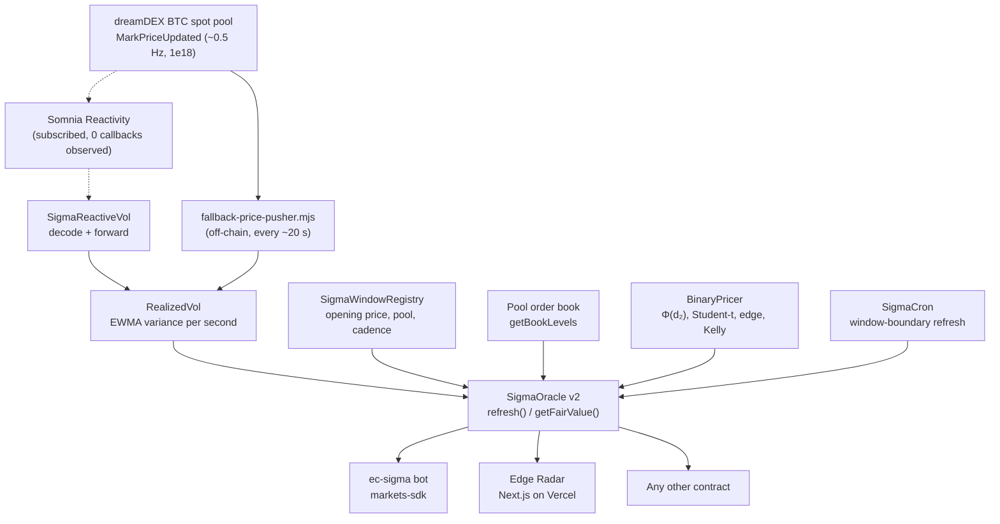
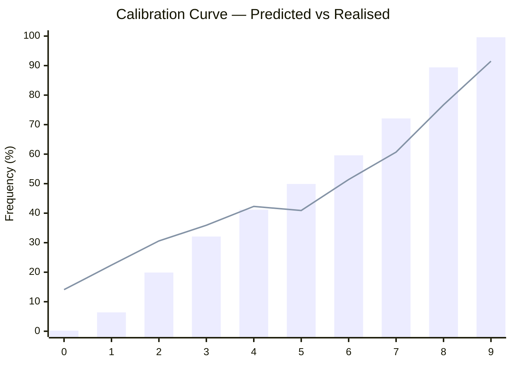
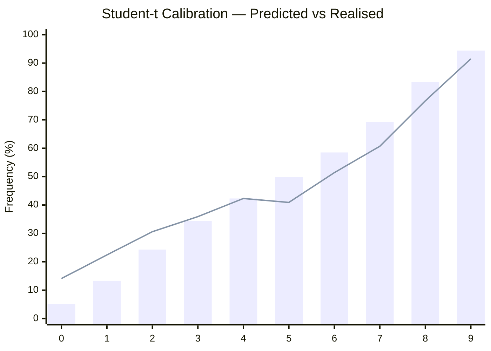

<p align="center"></p>

<h1 align="center">Sigma</h1>
<p align="center"><strong>One line to beat. Sigma tells you the odds.</strong></p>
<p align="center">The on-chain fair-value layer for dreamDEX Event Contracts, on Somnia.</p>

---

Sigma computes the probability that a dreamDEX Event Contract settles YES, compares it with the live order book, and publishes fair value, edge, break-even and a Kelly sizing signal on-chain, where any contract, bot or frontend can read it.

Hitansh Gopani · August 2026

| | |
|---|---|
| **Live app (Edge Radar)** | https://frontend-jade-beta-md6533cyvr.vercel.app/ |
| **Demo video** | https://youtu.be/nm2qWuQs7RU |
| **Source** | https://github.com/Professional50coder/somnia-sigma |
| **Network** | Somnia Shannon testnet, chain ID `50312` |
| **Explorer** | https://shannon-explorer.somnia.network |
| **SigmaOracle (v2)** | [`0x35cd22b3d983329d2ba9131d982a91e528a0b931`](https://shannon-explorer.somnia.network/address/0x35cd22b3d983329d2ba9131d982a91e528a0b931) |
| **Docs** | [Architecture](docs/ARCHITECTURE.md) · [Deployment Ledger](docs/DEPLOYMENT-LEDGER.md) · [Research Base](docs/RESEARCH.md) · [Backtest Results](backtest/RESULTS.md) |

<a href="https://youtu.be/nm2qWuQs7RU">

</a>

### At a glance

- **Pricing in Solidity.** Fair probability is `Φ(d₂)` under zero-drift GBM, plus a Student-t fat-tail variant, both computed in `SigmaOracle` on every `refresh()`.
- **Volatility on-chain.** `RealizedVol` keeps a time-aware EWMA of BTC mark-price returns from dreamDEX `MarkPriceUpdated` events.
- **Honest status.** 5 contracts live on Shannon testnet, 117 Hardhat tests, math cross-checked against SciPy. Reactivity push delivery is not working; a documented off-chain pusher feeds prices instead.

### Contents

1. [The problem](#the-problem)
2. [Why we built it](#why-we-built-it)
3. [What it does](#what-it-does)
4. [Use cases](#use-cases)
5. [Product tour](#product-tour)
6. [How it works: one window, end to end](#how-it-works-one-window-end-to-end)
7. [Architecture](#architecture)
8. [Models and protocols](#models-and-protocols)
9. [Backtesting and model research](#backtesting-and-model-research)
10. [Design decisions](#design-decisions)
11. [Feature matrix](#feature-matrix)
12. [Trust, security and limits](#trust-security-and-limits)
13. [Where it stands](#where-it-stands)
14. [Tech stack](#tech-stack)
15. [Repository layout](#repository-layout)
16. [Running locally](#running-locally)
17. [Testing](#testing)
18. [Deploying](#deploying)
19. [Roadmap](#roadmap)

---

## The problem

Prediction markets give users a market-implied probability. That probability is not necessarily fair.

Take a BTC event contract: **"Will BTC be above its opening price at expiry?"** The market quotes YES at 67.90%. What should it be? 68%? 55%? 72%?

Without an independent fair-value model, traders and market makers have no transparent reference for deciding whether the book is overpriced or underpriced.

dreamDEX's own `ec-maker` strategy is documented as quoting *"two-sided post-only... around fair probability"*. Nothing in the kit supplies that number on-chain.

**Sigma is that missing number.**

## Why we built it

A dreamDEX Event Contract is a fixed-payout binary: does BTC or ETH finish a fixed window (15m / 1h / 4h / 24h) at or above the price it opened at. There is no preset strike. The strike is the opening price. That makes the contract a cash-or-nothing digital option, and its fair value has a closed form.

The pieces to compute it were all on Somnia: a mark-price event stream, the window's opening price, and the live book. What was missing was a contract that put them together and published the result where anyone could check it. Sigma is built as that public pricing layer, not as a trading frontend or an AI agent. Bots and UIs sit on top of it.

## What it does

| Capability | Problem it removes |
|---|---|
| On-chain EWMA realised volatility (`RealizedVol`) | No trusted, inspectable σ for short-dated BTC windows |
| Window registry with publisher audit trail (`SigmaWindowRegistry`) | Opening price lives only off-chain (the venue's `strike` field is `"0"`), so a contract cannot self-discover a window |
| Fair value `Φ(d₂)` and Student-t fair value (`SigmaOracle`) | No reference probability to compare the book against |
| Edge in bps, break-even, Kelly fraction | Traders have to derive sizing and thresholds themselves |
| Typed not-ok reasons (`NoWindow`, `Expired`, `VolNotReady`, `NoSpot`, `ScaleMismatch`, `NoBook`) | Silence is indistinguishable from "no edge"; Sigma always says why it refuses to price |
| Window-boundary refresh (`SigmaCron`) | Stale fair values at window roll |
| `ec-sigma` bot (evaluate → quantize → place → settle) | Turning a signal into tick-correct orders and claims |
| Edge Radar frontend | Reading raw contract state to see fair value vs book |

## Use cases

- **Market makers** quoting `ec-maker` style around fair probability read `getFairValue(marketId)` instead of maintaining a private model.
- **Taker bots** act only when `edgeBps` clears a threshold (the bundled bot defaults to 200 bps, capped at 25 tUSDC per trade).
- **Other contracts** consume the same signal on-chain, for example to gate or size positions.
- **Traders** use Edge Radar to see fair value, book probability and edge per live window.
- **Researchers** use the backtest harness to measure calibration against real BTC minute candles.

## Product tour

The Edge Radar frontend lives in `frontend/` (Next.js App Router).

| Route | What you see |
|---|---|
| `/` | Landing page: hero, pipeline flashcards, live volatility waveform, wireframe-globe 3D scene |
| `/edge-radar` | Grid of open windows read from `SigmaWindowRegistry` + `SigmaOracle`: fair probability, book probability, edge, realised vol, Kelly, countdown. Radar-sweep 3D scene |
| `/window/[marketId]` | Window detail: fair value / market price / price chart tabs (lightweight-charts), model parameters |
| `/backtest` | Calibration curve from 3,000 real BTC minute candles, as interactive 3D bars |
| `/track-record` | Trade log with win/loss distribution, crystal 3D scene |

Also in the UI: MetaMask wallet connect with Somnia chain switch (viem), bot controls (Start / Stop / Claim with live on-chain reads), dark/light theme toggle (next-themes), and on-chain transaction and explorer references.

API routes:

| Route | Purpose |
|---|---|
| `GET /api/backtest` | Serves `../backtest/results.json` (404 if absent) |
| `GET /api/track-record` | Serves `../bot/track-record.json` |
| `GET /api/price-feed` | Server-side price push into `RealizedVol.recordPrice`; scheduled as a Vercel cron (see [Deploying](#deploying)) |

When the chain returns no open windows, the Edge Radar hook falls back to demo windows from `frontend/src/lib/sample-data.ts`.

A demonstrated live window produced **68.44% fair probability vs 67.90% book probability, +54 bps of edge**: the model's fair value sat above the quoted market probability for that window.

## How it works: one window, end to end

This is the flow that produced the first live Gaussian + Student-t fair value on 2026-09-04 (transactions in [`docs/DEPLOYMENT-LEDGER.md`](docs/DEPLOYMENT-LEDGER.md)).

1. **Price in.** The dreamDEX BTC spot pool (`0x3605f28aa7c50e7441211e77cb0762d49539326c`) emits `MarkPriceUpdated` roughly every 2 seconds. The intended path is Somnia Reactivity → `SigmaReactiveVol.onEvent` → `RealizedVol.recordPrice`. Because reactivity is not delivering, `scripts/fallback-price-pusher.mjs` polls the same event every ~20 s and calls `recordPrice` directly from the writer EOA. Provenance is unchanged; only delivery differs.
2. **Volatility ready.** `RealizedVol` updates an EWMA (λ = 0.94) of squared log returns per second. `sigmaWad(asset).ok` turns true after 30 samples and stays true while the last update is under 300 s old.
3. **Window published.** A publisher reads a live BTC market from the dreamDEX indexer, takes its real opening price (81281.9 in the 2026-09-04 proof), and calls `SigmaWindowRegistry.publishWindow`. Publisher and timestamp are recorded per window.
4. **Refresh.** `SigmaOracle.refresh(marketId)` reads σ, spot, the opening price and the pool's on-chain book (`getBookLevels`), checks the 1e2 vs 1e18 scale ratio, and computes via `BinaryPricer`: Gaussian fair probability, Student-t fair probability (`nuWad`, default 5.2), implied book probability, edge, break-even and Kelly. It emits `FairValuePublished`.
5. **Result.** Same transaction: `fairProbBps=3363` (33.63% Gaussian), `studentFairProbBps=3564` (35.64% Student-t), `impliedProbBps=3240` (32.40% real book), `edgeBps=123`, `studentEdgeBps=324`.
6. **Consume.** Any contract, the `ec-sigma` bot or Edge Radar reads `getFairValue(marketId)`. The bot quantizes to the venue tick grid and, in live mode, places orders and later claims settled positions.
7. **Roll.** `SigmaCron` was armed with a 900 s cadence to refresh at window boundaries. On-chain self-rescheduling is not used; rescheduling is done off-chain (see [Design decisions](#design-decisions)).

## Architecture


```mermaid
flowchart TD
    Pool["dreamDEX BTC spot pool<br/>MarkPriceUpdated (~0.5 Hz, 1e18)"]
    React["Somnia Reactivity<br/>(subscribed, 0 callbacks observed)"]
    Pusher["fallback-price-pusher.mjs<br/>(off-chain, every ~20 s)"]
    RV["SigmaReactiveVol<br/>decode + forward"]
    Vol["RealizedVol<br/>EWMA variance per second"]
    Reg["SigmaWindowRegistry<br/>opening price, pool, cadence"]
    Pricer["BinaryPricer<br/>Φ(d₂), Student-t, edge, Kelly"]
    Oracle["SigmaOracle v2<br/>refresh() / getFairValue()"]
    Cron["SigmaCron<br/>window-boundary refresh"]
    Book["Pool order book<br/>getBookLevels"]
    Bot["ec-sigma bot<br/>markets-sdk"]
    UI["Edge Radar<br/>Next.js on Vercel"]
    Other["Any other contract"]

    Pool -.-> React -.-> RV --> Vol
    Pool --> Pusher --> Vol
    Vol --> Oracle
    Reg --> Oracle
    Book --> Oracle
    Pricer --> Oracle
    Cron --> Oracle
    Oracle --> Bot
    Oracle --> UI
    Oracle --> Other
```

Pipeline in one line: **dreamDEX → RealizedVol → SigmaWindowRegistry → SigmaOracle → Edge Radar**.

### Components

| Component | Responsibility | Evidence |
|---|---|---|
| `BinaryPricer` (library) | Pure math: `Φ(d₂)`, Student-t CDF approximation, edge, break-even, Kelly | 45/45 SciPy golden vectors matched; also matched by an independent JS port |
| `RealizedVol` | EWMA σ per asset from `MarkPriceUpdated`; time-aware, staleness bound, min-sample gate, outlier rejection | 428+ samples on-chain, continuously updated |
| `SigmaReactiveVol` | Reactivity handler bridging mark prices into `RealizedVol` | Designed for push; currently not delivering |
| `SigmaWindowRegistry` | Opening price, expiry, interval, pool per window; publisher-audited | Single source of truth for window metadata |
| `SigmaOracle` | Publishes Gaussian and Student-t fair value, implied prob, edge, break-even, Kelly, `ok` + `reason` | Deployed on Shannon, readable by any contract |
| `SigmaCron` | Window-boundary refresh | Automated scheduler, not user-facing |
| `ec-sigma` bot (`bot/`) | Strategy, quantization, order placement, settlement/claims via `@somnia-chain/markets-sdk` | Quantization 10/10 tests; DRY_RUN pipeline |
| Edge Radar (`frontend/`) | Reads the deployed contracts and renders the signal | Live on Vercel |

### Deployed contracts

Somnia Shannon testnet, chain ID 50312. Deployer `0x0dDb3093df73Ca59F33420670125e0C686c0A468`. Every address was re-confirmed via `eth_getCode` ([`docs/STATUS.md`](docs/STATUS.md)).

| Contract | Address |
|---|---|
| RealizedVol | [`0xbd7eedfa178d8eb094449e3461e83195f4b062ef`](https://shannon-explorer.somnia.network/address/0xbd7eedfa178d8eb094449e3461e83195f4b062ef) |
| SigmaReactiveVol | [`0x5f6a29b5717841f6f7b394be6936ea176dc63d28`](https://shannon-explorer.somnia.network/address/0x5f6a29b5717841f6f7b394be6936ea176dc63d28) |
| SigmaWindowRegistry | [`0x16b9d8c364d70f38d0b04b760439efc794a46731`](https://shannon-explorer.somnia.network/address/0x16b9d8c364d70f38d0b04b760439efc794a46731) |
| SigmaOracle (v2 — Gaussian + Student-t) | [`0x35cd22b3d983329d2ba9131d982a91e528a0b931`](https://shannon-explorer.somnia.network/address/0x35cd22b3d983329d2ba9131d982a91e528a0b931) |
| SigmaCron (v2) | [`0x3e30784b649558befbb2897429d5a0e5544c007c`](https://shannon-explorer.somnia.network/address/0x3e30784b649558befbb2897429d5a0e5544c007c) |

Superseded by the 2026-09-04 upgrade: SigmaOracle v1 `0xe4c7be7dca5f536cfb18df61b01f3a952e902270`, SigmaCron v1 `0xc573c7b699690d1821aa4156ef7c09ee9ceba0e7`. The address book is [`deployments/somniaTestnet.json`](deployments/somniaTestnet.json); full transaction history is in [`docs/DEPLOYMENT-LEDGER.md`](docs/DEPLOYMENT-LEDGER.md).

### Oracle interface

```solidity
function refresh(bytes32 marketId) external returns (FairValue memory);
function refreshAll() external returns (uint256 count);
function getFairValue(bytes32 marketId) external view returns (FairValue memory);
function setNu(uint256 nuWad_) external; // onlyOwner, default 5.2e18

struct FairValue {
    uint256 fairProbBps; uint256 impliedProbBps; int256 edgeBps; uint256 breakEvenBps;
    uint256 kellyWad; uint256 sigmaWad; uint256 tauWad; uint64 updatedAt; Reason reason; bool ok;
    uint256 studentFairProbBps; int256 studentEdgeBps;
}
enum Reason { Ok, NoWindow, Expired, VolNotReady, NoSpot, ScaleMismatch, NoBook }
```

An empty book still yields a published fair value (`ok=true`, `reason=NoBook`), which is what a market maker or book seeder needs.

### External dependencies

| Item | Value |
|---|---|
| RPC | `https://dream-rpc.somnia.network` |
| `MarkPriceUpdated` topic0 | `0x2f0f7e3d58a217d311f516b216fa2f75081e17821bebb5f007fa57ff4e71f888` |
| BTC spot pool (WBTC:USDso) | `0x3605f28aa7c50e7441211e77cb0762d49539326c` |
| ETH spot pool (WETH:USDso) | `0xd180195da5459c7a0dea188ed61216ec43682b50` |
| tUSDC (collateral) | `0x70a86D8842FB63C4Ad2b7cdddF530eBf1BB25d8E` |
| Market indexer (GraphQL) | `https://dev.smk.somnia.host/v1/graphql` |
| Price-feed indexer (GraphQL) | `https://price-feed.dev.oracle.somnia.host/v1/graphql` |
| dreamDEX REST / WS (staging) | `https://stg.api.dreamdex.io/v0`, `wss://stg.api.dreamdex.io/v0/ws/public` |

## Models and protocols

### Gaussian fair value

Sigma treats the window's opening price as the strike. For opening price **S₀**, current price **S**, volatility **σ** and remaining time **τ**:

$$d_2 = \frac{\ln(S / S_0) + \frac{1}{2}\sigma^2 \tau}{\sigma\sqrt{\tau}}$$

$$\text{Fair Probability} = \Phi(d_2)$$

The implementation is cross-validated across Solidity (solady fixed-point + Abramowitz-Stegun rational approximation), a JS port, and SciPy's normal CDF. It is not an AI prediction or a black-box model. **It is deterministic financial mathematics running on-chain.**

### Student-t fat-tail model (live on-chain, alongside Gaussian)

A Student-t model with **ν ≈ 5.2** (method-of-moments estimate from the backtest) captures extreme moves the Gaussian misses:

$$F(x; \nu) \approx \Phi\left(x \cdot \sqrt{\frac{\nu - 1.5}{\nu + x^2 - 0.5}}\right)$$

Every `refresh()` publishes `fairProbBps` (Gaussian) and `studentFairProbBps` (Student-t, owner-settable `nuWad`, default 5.2) from the same spot, volatility and time inputs. First live proof, same transaction: **33.63% Gaussian vs 35.64% Student-t** against a real 32.40% book (+123 bps vs +324 bps edge). That is one live sample, not a claim that Student-t always finds more edge.

### Volatility

EWMA of squared log return per second, λ = 0.94 per observation, `MIN_SAMPLES = 30`, `STALENESS_SECONDS = 300`. The estimator divides by elapsed time, so the pusher sends only the current price and never backfills; replaying old events would corrupt the per-second rate.

### Why Somnia

Sigma is designed around Somnia's Event Contract ecosystem. Somnia's high-throughput, low-latency environment makes it practical to process every mark-price event and keep volatility state continuously updated on-chain. The chain is part of the pricing and decision layer, not only the place a bet settles.

### Protocols used

| Protocol | Used for | Why |
|---|---|---|
| dreamDEX spot pools (`MarkPriceUpdated`, `getBookLevels`) | Price feed and live book | The only subscribable BTC/ETH price event on Shannon. `OracleHub` emits no price event |
| Somnia Reactivity precompile | Intended keeper-free price delivery | No off-chain process in the design; currently 0 callbacks observed |
| Somnia cron subscription | Window-boundary refresh | Documented to require at least 32 SOMI in the owning EOA |
| `@somnia-chain/markets-sdk` | Market discovery, opening prices, book tops, orders, claims | The official SDK already handles tick/lot quantization, nonces and claims correctly |

## Backtesting and model research

Backtested against **3,000 real BTC/USDC one-minute candles** (~50 hours) from the dreamDEX price-feed indexer, covering about **230 independent windows** (~184 fifteen-minute, ~46 one-hour) and 5,620 checkpoints. Treat the result as directional, not a large-sample proof. Details: [`backtest/RESULTS.md`](backtest/RESULTS.md).

### Gaussian model (on-chain)

| Metric | Value |
|---|---|
| Brier score | 0.2071 |
| Log loss | 0.7426 |
| Estimated ν | ∞ |


```mermaid
xychart-beta
    title "Calibration Curve — Predicted vs Realised"
    x-axis ["0", "1", "2", "3", "4", "5", "6", "7", "8", "9"]
    y-axis "Frequency (%)" 0 --> 100
    bar [0.2, 6.4, 19.9, 32.1, 41.2, 49.9, 59.6, 72.1, 89.4, 99.6]
    line [14.1, 22.4, 30.6, 35.9, 42.3, 40.9, 51.4, 60.7, 76.7, 91.5]
```

**Fig. 1** — Gaussian calibration (bars predicted, line realised). Buckets 3–6 are well calibrated; the tails are systematically overconfident.

### Student-t model (ν ≈ 5.2)

| Metric | Value | Improvement |
|---|---|---|
| Brier score | 0.2007 | -3.1% |
| Log loss | 0.5898 | **-20.6%** |
| Tail calibration (bucket 0) | predicted 5.1% | 7× closer to 14% real |


```mermaid
xychart-beta
    title "Student-t Calibration — Predicted vs Realised"
    x-axis ["0", "1", "2", "3", "4", "5", "6", "7", "8", "9"]
    y-axis "Frequency (%)" 0 --> 100
    bar [5.1, 13.3, 24.3, 34.4, 42.3, 49.9, 58.5, 69.2, 83.3, 94.4]
    line [14.1, 22.4, 30.6, 35.9, 42.3, 40.9, 51.4, 60.7, 76.7, 91.5]
```

**Fig. 2** — Student-t calibration. Bucket 0 predicts 5.1% (Gaussian 0.2%); bucket 9 predicts 94.4% (Gaussian 99.6%).

Other measured effects: Brier improves as expiry approaches (0.260 at τ > 0.8 down to 0.109 at τ ≤ 0.2). 15m windows (Brier 0.192) calibrated better than 1h (0.222) in this sample, which may be noise. The backtest's policy simulation is explicitly discarded and its P&L should not be cited; see `backtest/RESULTS.md` §6.

## Design decisions

| Decision | Why | Trade-off |
|---|---|---|
| Price on-chain, trade off-chain | Fair value must be independently readable; the SDK already does quantization, nonces and claims correctly | Two codebases (Solidity + Node) to keep in sync |
| Closed-form `Φ(d₂)`, no ML | Deterministic, auditable, verifiable against SciPy | Zero-drift GBM understates fat tails (measured) |
| Publish Student-t next to Gaussian, not instead of it | Lets consumers compare; keeps the original model for continuity | Extra gas and two numbers to interpret |
| `SigmaWindowRegistry` carries the opening price | Venue `strike` is `"0"`; the opening price is only reachable off-chain | A trusted publisher; mitigated by per-window publisher/timestamp records |
| Publish not-ok with a typed reason | Silence looks like "no edge" | Consumers must handle `reason` |
| Scale guard before pricing | Opening price (1e2) and spot (1e18) differ; a mismatch would produce a confident wrong number | One more revert/refusal path |
| Time-aware EWMA (per second, not per tick) | Event cadence varies; tick-count EWMA would bias σ | Pusher must never backfill historical events |
| Fallback pusher instead of waiting on reactivity | Six correctly registered subscriptions delivered zero callbacks | An off-chain process; not "unattended" |
| Off-chain cron rescheduling | On-chain self-rescheduling not available as designed | Requires a running scheduler |
| Separate deployer and bot keys | Bot Kit serialises claims per key; concurrent bots on one key race nonces | Two accounts to fund |
| Hardhat + viem, `viaIR` | Stack depth in pricing math; Foundry not used | Slower compiles |

## Feature matrix

| Feature | Status | How to verify |
|---|---|---|
| On-chain volatility (EWMA) | **Live** | `scripts/verify-unattended.mjs` |
| On-chain fair-value pricing | **Live** | `npx hardhat test` (117 tests) |
| Fair-value oracle | **Live** | `scripts/publish-and-refresh-btc-window.mjs` |
| Student-t fat-tail model | **Live** | Published alongside Gaussian on every `refresh()`; `npx hardhat test` (117/117, incl. 6 covering this wiring) |
| Edge Radar frontend | **Live** | [Vercel deployment](https://frontend-jade-beta-md6533cyvr.vercel.app/) |
| Trading strategy | **Live (DRY_RUN)** | `bot/run-dry-run.mjs` |
| Live order path | Implemented, pending real-order validation | `bot/run-live.mjs --live` |
| Backtesting system | **Live** | `backtest/run-backtest.mjs` |
| Reactivity subscription | **Not delivering** | 6 tested, 0 callbacks |
| Builder fees | Implemented, disabled on Shannon | Mainnet only |
| Unattended operation | Not claimed | Requires two `sampleCount` increases with no Sigma process running |

## Trust, security and limits

**Testnet only.** Everything runs on Somnia Shannon testnet (50312). Mainnet (5031) is deliberately absent from `hardhat.config.ts` and is not a deploy target.

**What you are trusting:**

- **Price source.** Mark price is order-book derived, not a signed oracle attestation. Cross-checked at 0.12% from the perp `FundingUpdated.indexPrice` on BTC. Acceptable for testnet.
- **Window publisher.** Opening prices are pushed by an allow-listed publisher; each window records who published it and when.
- **Price delivery.** Prices arrive via an off-chain scheduled pusher signed by the writer EOA (`RealizedVol.writer` is the deployer), not via reactivity.
- **Owner.** The oracle owner can change `nuWad` (it must stay above 2.0).

**Known limitations:**

| Limitation | Impact | Status |
|---|---|---|
| Zero-drift GBM understates fat tails | Predicted 0.2% realises 14% | Student-t improves to 5.1%, live in SigmaOracle v2 |
| Mark price, not signed oracle | Cross-checked 0.12% from perp index | Acceptable for testnet |
| Builder fees disabled | Revenue model testable on mainnet only | Implemented, waiting |
| Reactivity not delivering | 6 subscriptions tested, 0 callbacks | Fallback price pusher works |
| ~2 days of backtest data | Calibration is directional | More history needed |
| Track record | `bot/track-record.json` holds sample entries with placeholder market IDs, not real fills | Real orders pending |

**Reactivity, in detail.** Six subscriptions across two owners and two fee tiers were confirmed registered via `getSubscriptionInfo`, with the source feed firing at ~0.5 Hz. Ruled out: topic/emitter/selector, `isGuaranteed` true and false, fees up to 20/100 gwei against a 6 gwei base fee, an owner at 50 STT (above the 32 SOMI/STT threshold), handler logic (an ungated diagnostic probe also received nothing), and `msg.sender` gating. Write-up for the dev channel: [`docs/TELEGRAM-DRAFT.md`](docs/TELEGRAM-DRAFT.md).

**Keys.** Private keys are environment-only (`DEPLOYER_PRIVATE_KEY`). `.env`, `.secrets/` and `*.key` are gitignored. `scripts/generate-wallet.mjs` writes to `.secrets/WALLET.md`, which is gitignored. The Vercel `/api/price-feed` route signs with `DEPLOYER_PRIVATE_KEY` from the Vercel environment, so that key lives on the host; use a throwaway testnet key.

**What this is not:**

| Claim | Reality |
|---|---|
| Not an AI verdict product | Core is closed-form math (`Φ(d₂)` and Student-t CDF), validated against SciPy |
| Not a claim of profitability | Publishes a measurable, auditable *signal* with realised results, losses included |
| Not overstating what's live | Every number is backed by a transaction hash or marked as not yet proven |

## Where it stands

- 5 contracts deployed on Shannon; SigmaOracle and SigmaCron upgraded to v2 on 2026-09-04 to add Student-t.
- First live end-to-end fair value on 2026-08-27: 68.44% fair vs 67.90% book, +54 bps edge, Kelly 1.68%, on a 24h window 41% through its life. Modest by design: mid-life window, σ from ~10 minutes of samples.
- First live Gaussian + Student-t fair value on 2026-09-04 (see [How it works](#how-it-works-one-window-end-to-end)).
- Bot runs the full pipeline in DRY_RUN; real orders pending.
- Shannon BTC binary markets now show real two-sided books, so Sigma competes on an existing book rather than seeding an empty one. `docs/INTEGRATION.md` §11 records the earlier empty-book observation.
- Version `0.2.0-dev` ([`VERSION`](VERSION), [`CHANGELOG.md`](CHANGELOG.md)).

### What Sigma delivers, by judging criterion

| Criterion | What Sigma delivers |
|---|---|
| **Innovation** — a novel use of Event Contracts | On-chain fair probability using closed-form Black-Scholes — the only project computing the price itself rather than quoting, verifying, or wrapping it |
| **Technical depth** — effective use of DreamDEX APIs/SDKs | 5 Solidity contracts, 117 Hardhat tests, triple-validated math (Solidity + TypeScript + SciPy), on-chain EWMA volatility, Gaussian + Student-t fair value both live, complete bot pipeline |
| **User experience** — intuitive and compelling | Three.js 3D backgrounds, anime.js scroll animations, live Edge Radar with wallet connect, real-time fair value vs market price display |
| **Ecosystem impact** — potential for adoption | Infrastructure layer any prediction market can read from — bots, frontends, and other contracts all consume the same on-chain signal |
| **Clear communication** — problem, solution, demo | Live deployment on Shannon testnet, video walkthrough, reproducible repo, honest status table |

## Tech stack

| Layer | Stack |
|---|---|
| Contracts | Solidity 0.8.28 (optimizer 200 runs, `viaIR`), solady fixed-point math |
| Contract tooling | Hardhat 3, `@nomicfoundation/hardhat-toolbox-viem`, TypeScript |
| Reference math | Python 3.11 + SciPy (`reference/pricer_reference.py`) |
| Chain clients | viem, `@somnia-chain/markets-sdk`, `@somnia-chain/reactivity` |
| Bot / scripts | Node.js ESM (`.mjs`), dotenv |
| Frontend | Next.js 16 + React 19, Tailwind CSS v4, Radix UI primitives, TanStack Query |
| Charts / 3D | lightweight-charts, Three.js |
| Animation | anime.js v4 (primary), framer-motion in a few components |
| UI utilities | sonner, next-themes, date-fns, qrcode.react, lucide-react |
| Hosting | Vercel |

### Frontend animation (anime.js v4)

| Feature | Where | Effect |
|---|---|---|
| `scrambleText` | Hero tagline | Cinematic decode |
| `splitText` | Hero "Sigma" title | Letter-by-letter reveal with rotateX, stagger from center |
| `onScroll` | Every section, card, list | Replaces manual IntersectionObserver |
| `stagger from:"center"` | KPI cards, flashcards, stats | Center-outward reveal |
| `stagger grid` | Edge Radar market grid | 2D grid-aware stagger (3 cols × N rows) |
| `stagger jitter` | StaggerList, flashcards | Random ±40ms offset |
| `spring()` | FlowDiagram nodes, stats cards, market cards | Physics-based easing |
| `keyframes` | CTA buttons, stats hover | Multi-step bounce: scale 1→1.04→0.98→1.02→1 |
| `createLayout` | Category filter | Layout-aware reorder animations |
| `SVG drawable` | Data flow arrows | Progressive stroke drawing on scroll |
| `lerp` / `damp` | Three.js hero camera | Smooth mouse-reactive camera interpolation |
| `random()` | Live price ticker | Randomized price movement |
| `onRender` | Solution formula | Progress-tracked glow pulse at 50% |
| `createTimeline` | Three.js hero entrance | Sequenced globe, terrain, particles, rings |

### 3D scenes (Three.js)

| Scene | Page | Elements |
|---|---|---|
| **Wireframe Globe** | Landing | Icosahedron wireframe, 600 floating particles, wave terrain, 3 orbiting rings, 24 node points with connection lines |
| **Radar Sweep** | Edge Radar | Rotating sweep, blip points, cross lines, particles |
| **Calibration Bars** | Backtest | 3D bar chart, grid plane, diagonal reference line, particles |
| **Crystal Octahedron** | Track Record | Rotating octahedron, 2 orbiting rings, win/loss columns, particles |

All scenes use anime.js `createTimeline` for sequenced entrances and `lerp`/`damp` for camera movement.

## Repository layout

```
contracts/           5 Solidity contracts + BinaryPricer library, interfaces, mocks, test harness
test/                Hardhat tests (117) + test/vectors/binary_pricer.json (SciPy golden values)
reference/           pricer_reference.py — SciPy source of truth
scripts/             deploy, compile, diagnostics, price feed, cron subscription, auto-trade,
                     scheduled-runner, proof-of-work, Student-t redeploy
bot/                 ec-sigma strategy, quantize, order, settle, dry-run and live runners
backtest/            data fetch, JS pricer port, historical replay, calibration, results
frontend/            Next.js 16 + React 19 Edge Radar terminal
deployments/         somniaTestnet.json — the single address book
proofs/              proof-of-work and scheduled-runner logs
brand/               Sigma logo assets
docs/                architecture, design, research, integration, deployment, status, feedback
```

### Proof of work

| File | Description |
|---|---|
| `proofs/PROOF-OF-WORK-2026-08-29.md` | Session record: 6 transactions, 5 price pushes, samples 69 → 74, `ok` false → true |
| `proofs/proof-*.json` | Automated execution proofs with timestamps |
| `proofs/scheduled-log-*.json` | Scheduled runner execution logs |
| `runner-output.log`, `runner-error.log` | Runner stdout/stderr captures; generated locally, gitignored (`*.log`) |

## Running locally

Prerequisites: Node.js (24.x used in development), npm, Python 3.11 with SciPy only if regenerating golden vectors. Shannon STT from the faucet at `testnet.somnia.network` for any write.

```bash
# Contracts
npm install
npx hardhat test

# Frontend
cd frontend
npm install
npm run dev            # http://localhost:3000

# Bot — dry run (no signing)
cd bot
npm install
node run-dry-run.mjs   # add --loop to poll every 30s

# Bot — live (requires DEPLOYER_PRIVATE_KEY in .env)
node run-live.mjs --live

# Backtest
cd backtest
node run-backtest.mjs

# From the repo root
node scripts/scheduled-runner.mjs      # price pusher + market watcher + state logger
node scripts/auto-trade.mjs            # detect → publish → refresh → evaluate → trade (DRY_RUN default)
node scripts/subscribe-cron-btc.mjs    # subscribe to BTC price feed
node scripts/fallback-price-pusher.mjs # off-chain price pusher only
```

Environment (`bot/.env.example`):

| Variable | Purpose | Default |
|---|---|---|
| `DEPLOYER_PRIVATE_KEY` | Required for `--live`, `--maker`, `--claim` and all write scripts | — |
| `SIGMA_MIN_EDGE_BPS` | Minimum edge to act | 200 |
| `SIGMA_MAX_STAKE` | Max tUSDC per trade | 25 |
| `AUTO_CLAIM` | Claim settled positions on each pass | — |
| `SOMNIA_TESTNET_RPC` | RPC override | `https://dream-rpc.somnia.network` |

Frontend reads `NEXT_PUBLIC_CHAIN_ID`, `NEXT_PUBLIC_RPC`, `NEXT_PUBLIC_DREAMDEX_REST`, `NEXT_PUBLIC_DREAMDEX_WS`, `NEXT_PUBLIC_INDEXER` and `NEXT_PUBLIC_PRICE_FEED` (public endpoints, set in `frontend/.env.local`).

## Testing

```bash
npx hardhat test                    # 117 tests: BinaryPricer, RealizedVol, SigmaReactiveVol,
                                    # SigmaWindowRegistry, SigmaOracle, SigmaCron
cd bot && npm test                  # quantization: 10/10
node backtest/validate-pricer.mjs   # JS port vs SciPy vectors: 45/45, max abs error 6.925e-8
```

Golden vectors are regenerated with `python reference/pricer_reference.py` inside a project venv. The rule is strict TDD: the full suite green, with `BinaryPricer` matching SciPy, before anything is deployed.

## Deploying

**Contracts.** Deploy order, dependencies first: `RealizedVol` → `SigmaReactiveVol` (then `realizedVol.setWriter`) → `SigmaWindowRegistry` → `SigmaOracle` → `SigmaCron`. Entry point `scripts/deploy.ts` / `scripts/deploy-live.mjs`; the Student-t upgrade used `scripts/redeploy-oracle-student-t.mjs`, which redeploys only the oracle and cron. Output goes to `deployments/somniaTestnet.json`; nothing else hard-codes addresses. Record every write in `docs/DEPLOYMENT-LEDGER.md`. Full runbook: [`docs/DEPLOYMENT.md`](docs/DEPLOYMENT.md).

```bash
npx hardhat run scripts/deploy.ts --network somniaTestnet
```

**Frontend.** Deployed to Vercel from this repo (project `frontend`, Next.js). `frontend/vercel.json` schedules `GET /api/price-feed` daily at 00:00 UTC; that route needs `DEPLOYER_PRIVATE_KEY` in the Vercel environment. `/api/backtest` and `/api/track-record` read files from sibling directories (`../backtest`, `../bot`). The app must use `frontend/src/app/` only: a stray `frontend/app/` directory previously shadowed it and dropped every page from the build (fixed in `d387027`).

## Roadmap

| Priority | Item | Impact | Status |
|---|---|---|---|
| 1 | Reactivity delivery | Remove the off-chain dependency | 6 tested, 0 callbacks; fallback works |
| 2 | ~~Student-t on-chain~~ | ~~-20.6% log loss, better tail calibration~~ | **Done** — SigmaOracle v2, live proof in `docs/DEPLOYMENT-LEDGER.md` |
| 3 | Builder fees | Revenue model | Implemented, disabled on Shannon |
| 4 | Live bot validation | Prove the full pipeline end to end | DRY_RUN works, real orders pending |
| 5 | Market data integration | Richer feed for a better backtest | GraphQL works, price history limited |

None of these are architectural. The hard parts (on-chain vol measurement, closed-form pricing, window-boundary scheduling) already work.

---

**Hitansh Gopani** · [hitansh.gopani@somaiya.edu](mailto:hitansh.gopani@somaiya.edu) · [@Hitansh54](https://x.com/Hitansh54) · [GitHub](https://github.com/Professional50coder)

## License

MIT
